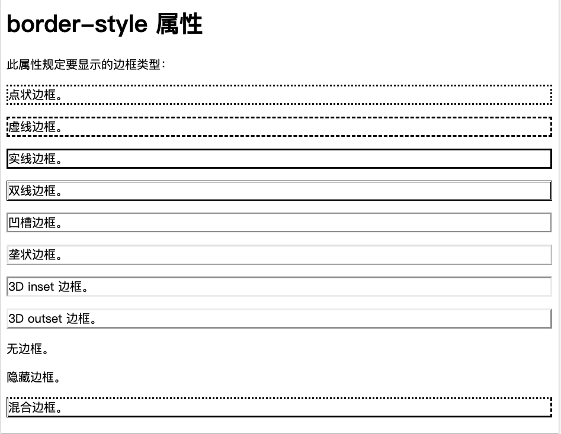
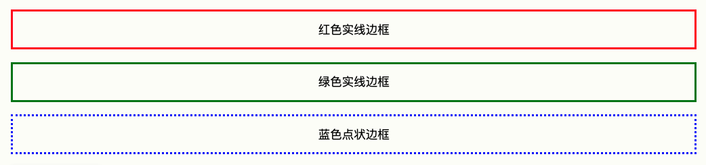

# css 边框属性
border 属性允许指定元素边框的样式、宽度、颜色。

## css 边框样式
border-style属性指定要显示的边框类型。允许的值如下：
- dotted，点线边框
- dashed，虚线边框
- solid，实线边框
- double，双边框
- groove，3D坡口边框，效果取决于border-color的值
- ridge，3D脊线边框，效果取决于border-color的值
- inset，3D inset边框，效果取决于border-color的值
- outset，3D outset边框，效果取决于border-color的值
- none，无边框
- hidden，隐藏边框

###### 关于border-style
border-style属性可以设置1到4个值，用于（上、右、下、左）4条边框。<br>
<font color="red">注意：除非设置了border-style属性，否则其他css边框属性将不会起作用。</font>

```html
<!DOCTYPE html>
<html>
<head>
<style>
p.dotted {border-style: dotted;}
p.dashed {border-style: dashed;}
p.solid {border-style: solid;}
p.double {border-style: double;}
p.groove {border-style: groove;}
p.ridge {border-style: ridge;}
p.inset {border-style: inset;}
p.outset {border-style: outset;}
p.none {border-style: none;}
p.hidden {border-style: hidden;}
p.mix {border-style: dotted dashed solid double;}
</style>
</head>
<body>

<h1>border-style 属性</h1>

<p>此属性规定要显示的边框类型：</p>

<p class="dotted">点状边框。</p>
<p class="dashed">虚线边框。</p>
<p class="solid">实线边框。</p>
<p class="double">双线边框。</p>
<p class="groove">凹槽边框。</p>
<p class="ridge">垄状边框。</p>
<p class="inset">3D inset 边框。</p>
<p class="outset">3D outset 边框。</p>
<p class="none">无边框。</p>
<p class="hidden">隐藏边框。</p>
<p class="mix">混合边框。</p>

</body>
</html>
```

效果如下图：



## 边框宽度
可以用border-width属性指定4条边框的宽度。

宽度值有两种：
1. 设置特定大小的宽度，单位是px，pt，cm，em。
2. 预定义值，thin，medium，thick。

```css
p.one {
  border-style: solid;
  border-width: 5px;
}

p.two {
  border-style: solid;
  border-width: medium;
}

p.three {
  border-style: dotted;
  border-width: 2px;
} 

p.four {
  border-style: dotted;
  border-width: thick;
}
```

## 特定边的宽度
border-width属性可以设置1到4个值。
```css
p.one {
  border-style: solid;
  border-width: 5px 20px; /* 上边框和下边框为 5px，其他边为 20px */
}

p.two {
  border-style: solid;
  border-width: 20px 5px; /* 上边框和下边框为 20px，其他边为 5px */
}

p.three {
  border-style: solid;
  border-width: 25px 10px 4px 35px; /* 上边框 25px，右边框 10px，下边框 4px，左边框 35px */
}
```

## 边框颜色
border-color用于设置4个边框的颜色。

可以通过一下方式设置颜色：
- name，颜色名称，例如"red"
- HEX，十六进制，例如"#ff0000"
- RGB，例如"rgb(255, 0, 0)"
- HSL，例如"hsl(0, 100%, 50%)"
- transparent

<font>注意：如果未设置border-color，则它将继承元素的颜色</font>

```css
p.one {
  border-style: solid;
  border-color: red;
}

p.two {
  border-style: solid;
  border-color: green;
}

p.three {
  border-style: dotted;
  border-color: blue;
}
```

效果如下图：


#### 特定边框的颜色
分别指定4个边框的颜色，但是需要注意顺序（上右下左）。
```css
p.one {
  border-style: solid;
  border-color: red green blue yellow; /* 上红、右绿、下蓝、左黄 */
}
```

## 边框 - 单独的边
css提供了专门指定每一条边框样式的属性。
- border-top-style
- border-right-style
- border-bottom-style
- border-left-style

它的工作原理是这样的：
如果 border-style 属性设置四个值：

border-style: dotted solid double dashed;
上边框是虚线
右边框是实线
下边框是双线
左边框是虚线
如果 border-style 属性设置三个值：

border-style: dotted solid double;
上边框是虚线
右和左边框是实线
下边框是双线
如果 border-style 属性设置两个值：

border-style: dotted solid;
上和下边框是虚线
右和左边框是实线
如果 border-style 属性设置一个值：

border-style: dotted;
四条边均为虚线


## border - 简写属性
为了缩减代码，可以在一个属性中指定所有单独的边框属性。

border属性简写顺序：
1. border-width
2. border-style(必须)
3. border-color

```css
p {
  border: 5px solid red;
}
```

还可以仅指定一条边的所有属性。
比如仅设置左边框：
```css
p {
  border-left: 6px solid red;
  background-color: lightgrey;
}
```


## 圆角边框
border-radius属性用于设置圆角边框。
```css
p {
  border: 2px solid red;
  border-radius: 5px;
}
```
