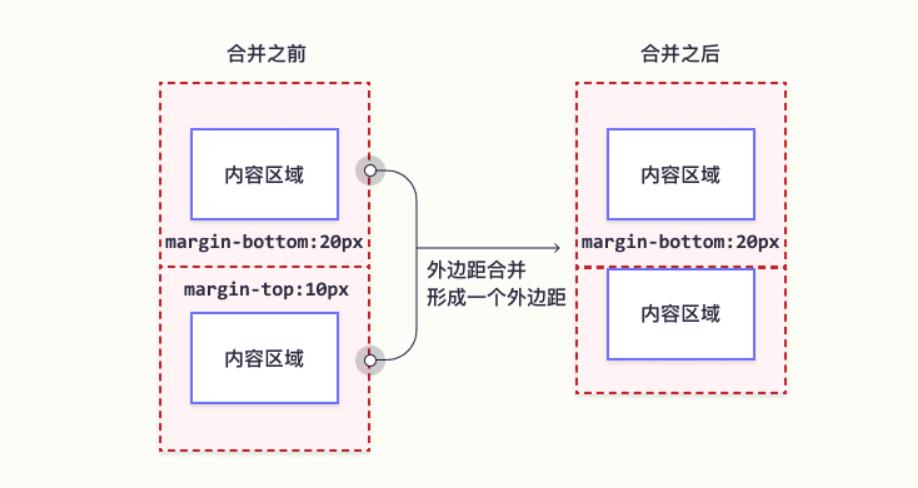
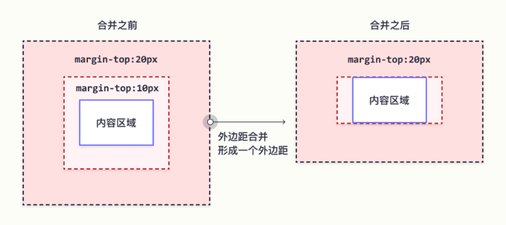
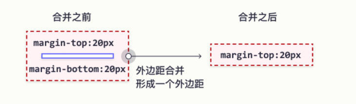
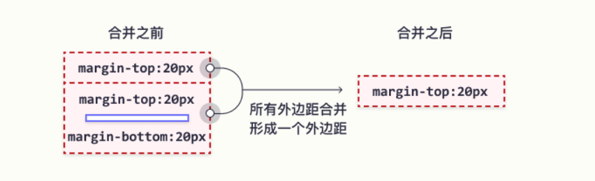
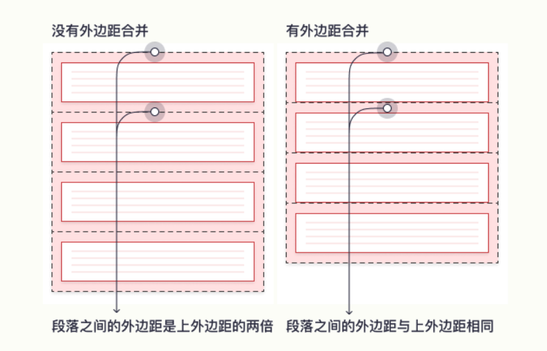

# css 边距

## 外边距
通过margin属性用于在任何定义的边框之外，为元素周围创建空间。

#### margin - 单独的边
css拥有用于为元素的每一侧指定外边距的属性：
- margin-top
- margin-right
- margin-bottom
- margin-left

所有外边距属性，都可以设置下列值：
- auto，浏览器来计算外边距
- length，以px，pt，cm，em等单位指定外边距
- %，百分比
- inherit，指定应从父元素继承外边距

例如，为p元素的4个边设置不同的外边距
```css
p {
  margin-top: 100px;
  margin-bottom: 100px;
  margin-right: 150px;
  margin-left: 80px;
}
```

#### margin - 简写属性
工作原理：
如果margin属性有4个值，那么分别对应4条边，顺序是'上右下左'（记不住，就联想顺时针方向）
```css
p {
  margin: 25px 50px 75px 100px;
}
```

如果margin属性设置3个值。
第一个值代表上，第二值代表左右，第三个值代表下。
```css
p {
  margin: 25px 50px 75px;
}
```

如果margin属性设置了2个值。
第一个值代表上下，第二个值代表左右。

#### auto值
如果margin属性值为auto，元素在其容器中水平居中。
元素将占据指定的宽度，剩余空间将在左右边界之间平均分配。

#### inherit值
```css
div {
  border: 1px solid red;
  margin-left: 100px;
}

p.ex1 {
  margin-left: inherit;
}
```
如果p位于div之中，那么p就是div的子元素，div是p的父元素。
如果它们有父子关系，而且子元素的属性值为inherit，那么子元素将继承父元素此属性的值。


## css 外边距合并

#### 什么是外边距合并？
外边距合并指的是，当两个垂直外边距相遇时，它们将形成一个外边距。
合并后的外边距的高度等于发生合并的外边距高度中的较大者。


<font color="red">注意：只有垂直外边距可以合并。而且所谓的合并是取最大值，并非求和。</font>

当一个元素包含另一个元素时，上下外边距(垂直外边距)也会发生合并。


当一个元素的内容为空时，上外边距和下外边距就触碰到一起，然后会发生合并。


如果这个外边距遇到另一个元素的外边距，还会发生合并。


#### 为什么会有外边距合并这种神奇的操作？
假设有一列p标签，如果没有外边距合并，各个段落之间的间距为两倍的外边距，但是首个段落只有1个外边距，看起来不协调。
在使用了外边距合并后，就会让各个段落的外边距表现一致。


<font color="red">注意：只有普通文档流中块框的垂直外边距才会发生外边距合并。行内框、浮动框、绝对定位之间的外边距不会合并。</font>


## 内边距
padding属性用于在任何定义的边界内的元素周围生成空间。

#### padding - 单独的边
和margin一样，padding也拥有单边属性：
- padding-top
- padding-right
- padding-bottom
- padding-left

所有内边距属性都可以设置以下值：
- length，以px，pt，cm等单位指定内边距
- %，相对于元素宽度的百分比计算内边距
- inherit，从父元素继承内边距


#### padding - 简写属性
工作原理：
和margin同理。


#### 内边距和元素高度
width属性用于指定元素内容区域的宽度。
内容区域是元素（盒模型）的内边距、边框、外边距内的部分。
因此，如果元素拥有指定的宽度，则添加到该元素的内边距会添加到元素的总宽度中，而这通常是不希望的结果。

```css
div {
  width: 300px;
  padding: 25px;
}
```
例如这个div，宽度为300px，但是实际宽度将是350px（300px + 左内边距25px + 右内边距25px）

如果想让宽度保持为300px，无论填充量如何，可以使用box-sizing属性。
这将导致元素保持其宽度，如果增加内边距，则可用空间会减少。

