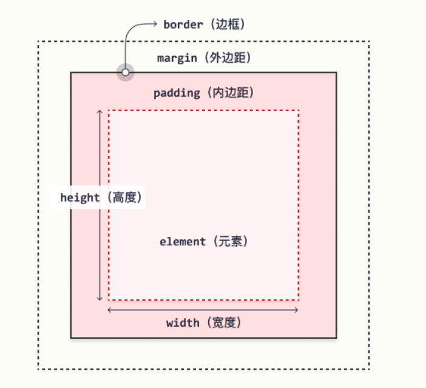

# css 框模型
所有HTML元素都可以视为方框。
在css中，在谈论设计和布局时，会使用术语"盒模型"或者"框模型"。

css框模型实质上是一个包围每个HTML元素的框。
它包括：外边距、边框、内边距、实际内容。



对不同部分的说明：
- 内容，框的内容，其中显示文本和图像
- 内边距，清除内容周围的预期，内边距是透明的。
- 边框，围绕内边距和内容的边框。
- 外边距，清除边界外的区域。外边距也是透明的。

框模型允许我们在元素周围添加边框，并定义元素之间的空间。

<font color="yellow">提示：背景应用于由内容和内边距、边框组成的区域。</font>

浏览器会默认设置内边距、边框和外边距，默认值是0.
但是许多元素由用户代理样式表设置外边距和内边距。
一般而言，我们可以使用通用选择对所有元素进行设置。
```css
* {
  margin: 0;
  padding: 0;
}
```

#### 计算元素的总宽度和总高度
元素的总宽度应该这样计算：

元素总宽度 = 宽度 + 左内边距 + 右内边距 + 左边框 + 右边框 + 左外边距 + 右外边距

元素的总高度应该这样计算：

元素总高度 = 高度 + 上内边距 + 下内边距 + 上边框 + 下边框 + 上外边距 + 下外边距
