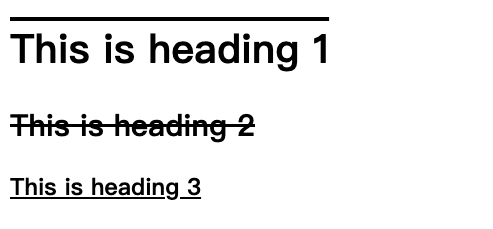

# css 文本

### 文本颜色
color 属性用于设置文本颜色。可选值如下：
- 颜色名，例如"red"
- 十六进制值，例如"#ff0000"
- RGB值，例如"rgb(255,0,0)"


### 文本对齐
text-align 属性用于设置文本的水平对齐方式。
可选值有三个：
- center
- left
- right
- justify

<font color="yellow">警告：justify会拉伸每一行文字，使每一行长度都相等。</font>


### 文本方向
direction 和 unicode-bidi 属性可以改变元素的文本方向。


### 垂直对齐
vertical-align 属性设置元素的垂直对齐方式。
可选值如下：
- top
- middle
- bottom


# css 文本装饰

### 文字装饰
text-decoration 属性用于设置或删除文本装饰。
text-decoration: none; 常用于从链接上删除下划线。
可选值为：
- overline
- line-through
- underline



### 文本转换
text-transform 属性用于指定文本中的大写和小写字母。
可选值：
- uppercase，全转大写
- lowercase，全转小写
- capitalize，单词首字母大写


### 文字间距
text-indent 属性用于指定文本第一行的缩进。


### 字母间距
letter-spacing 属性指定文本中字符之间的间距。


### 行高
line-height


### 字间距
word-specing 属性用于指定字（单词）之间的距离


### 空白
white-spece 属性指定元素空白的处理方式。
例如段落不允许换行：
```css
p {
  white-space: nowrap;
}
```


### 文本阴影
text-shadow
```css
h1 {
  text-shadow: 2px 2px;
}
```

### 给阴影添加颜色
```css
h1 {
  text-shadow: 2px 2px red;
}
```


### 给阴影添加模糊效果
```css
h1 {
  text-shadow: 2px 2px 5px red;
}
```


