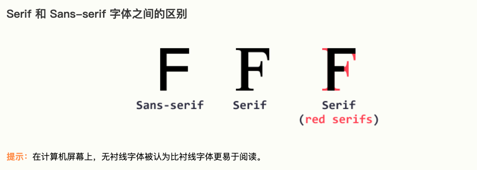
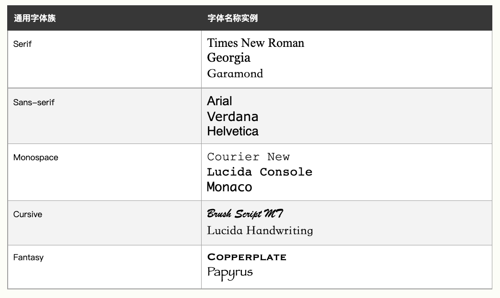

# css 字体

### 字体的选择
字体选择去向应该是，易于阅读、颜色鲜明、文本大小合适。


### 通用字体族
在css中，有五个通用字体族：
- 衬线字体（Serif），在每个字符的边缘有个小的笔触。形式感？优雅感？
- 无衬线字体（Sans-serif），字体线条整洁（没有笔触）。现代而简约？
- 等宽字体（Monospace），所有字母都有相同的固定宽度。机械式外观？
- 草书字体（Cursive），模仿人类的笔迹。
- 幻想字体（Fantasy），装饰性的俏皮字体？




### 一些字体的例子



### font-family 属性
在css中，使用font-familly属性规定文本的字体。

```css
.p1 {
  font-family: "Times New Roman", Times, serif;
}

.p2 {
  font-family: Arial, Helvetica, sans-serif;
}

.p3 {
  font-family: "Lucida Console", "Courier New", monospace;
}
```


### 字体样式
font-style, 可选值：
- normal，正常
- italic，斜体
- oblique（支持少，忽略）


### 字体粗细
font-weight，可选值：
- normal
- bold


### 字体变体
font-variant 指定是否以small-caps字体显示文本。


### 字体大小
font-size


### 用em设置字体大小
W3C建议使用em尺寸单位。
1em等于当前字体大小，浏览器的默认为本大小为16px。因此1em=16px。

例如，你想设置字体大小为40px，那么应该设置2.5em（40 / 16）

使用em的好处是，可以在所有浏览器中调整文字大小。但IE会有问题。


### 使用百分比和em组合
```css
body {
  font-size: 100%;
}

h1 {
  font-size: 2.5em;
}

h2 {
  font-size: 1.875em;
}

p {
  font-size: 0.875em;
}
```


### 响应式字体大小
可以使用vw单位设置文本大小，它的意思是"视口宽度"(viewport width)
这样，文本大小将会遵循浏览器窗口的大小而改变。


### 谷歌字体
如果不想用HTML中任何标准字体，可以使用Google Fonts API向页面添加数百种其他字体。
只需添加一个样式表链接。
```html
<!DOCTYPE html>
<html>
<head>
<link rel="stylesheet" href="https://fonts.googleapis.com/css?family=Sofia">
<style>
body {
  font-family: "Sofia";
  font-size: 22px;
}
</style>
</head>
<body>

<h1>Sofia Font</h1>
<p>Lorem ipsum dolor sit amet, consectetuer adipiscing elit.</p>

</body>
</html>
```


### 字体属性
font属性是下列属性的简写。
- font-style
- font-variant
- font-weight
- font-size/line-height
- font-family

例如：
```css
p.a {
  font: 20px Arial, sans-serif;
}

p.b {
  font: italic small-caps bold 12px/30px Georgia, serif;
}
```
<font color="red">注意：font-size和font-family的值是必须的，如果缺少其他值之一，则会使用默认值。</font>


